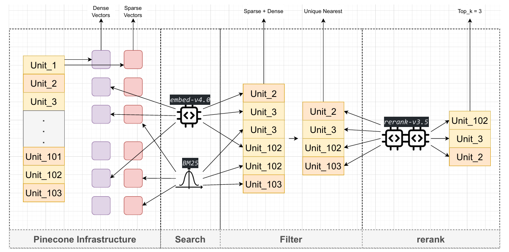
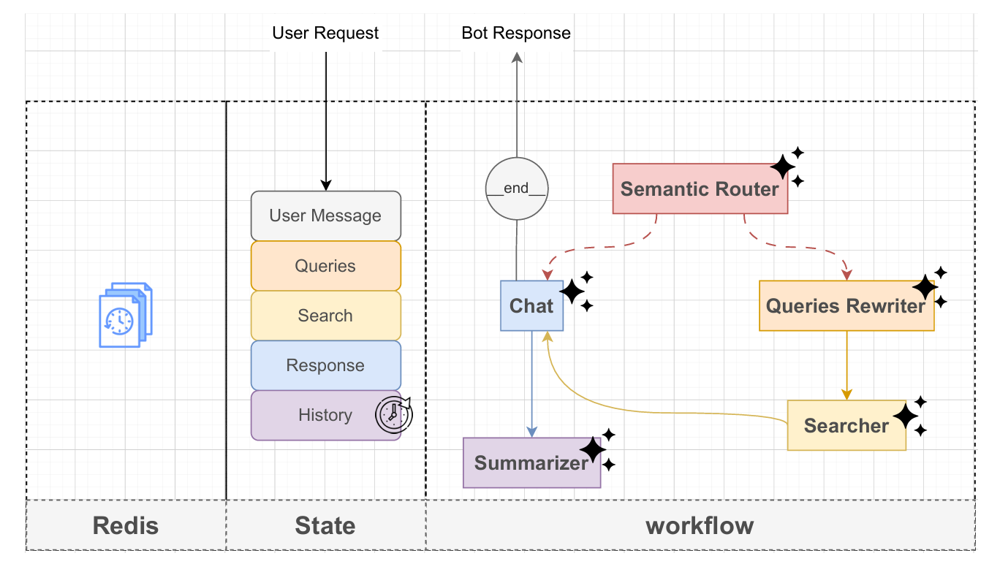

# Natural Language Understanding and Processing

This repository contains my work on applying NLP tasks to automate business processes. The goal is to create an intelligent assistant for a system guide written in Arabic.

## Problem Analysis

### Challenges

1. __Learning Curve:__ End-users face significant time investment to become familiar with the system.
2. __High Training Costs:__ The expense associated with formal training programs and instructors is considerable.
3. __Support Bottlenecks:__ For immediate issues, users are reliant on contacting customer service, leading to delays.

### Proposed Solution

The goal is to build an autonomous system that can learn, reason, and act as a "system expert." This solution will leverage Natural Language Understanding and Processing to interact with users, specifically tailored for the Arabic language.

#### Evaluation Metrics

The success of the solution will be measured by:

* __Latency:__ The response time of the system.
* __Accuracy:__ Overall correctness, with a strong focus on __Precision__.
* __Cost:__ The computational and operational cost of the solution.

---

## Data Preprocessing

### Data Source

The primary data source is a system guide in PDF format:

* It is written in Arabic using a custom (non-standard) font.
* The PDF contains many embedded screenshots.
* It includes standard PDF elements like page numbers and a table of contents.

### Extraction Pipeline

1. __Image Extraction:__ First, all images (including screenshots) are extracted from the PDF.
2. __Text Extraction:__ The extracted images, combined with a targeted prompt, are fed into a VLM.
3. __Structural Preservation:__ The VLM is instructed to output the text in Markdown format. This preserves the semantic structure of headings, lists, and tables.
4. __Aggregation:__ The output is written to a single text file, using a special delimiter to mark page breaks and preserve the original page numbers.

---

## Knowledge Base Architecting

* __Goal:__ Separate the raw text into smaller, semantically meaningful units (units) for retrieval.
* __Initial Approach:__ Simple chunking is difficult because explanations for a single concept are not always in sequential sentences.
* __Refined Strategy:__
    1. The table of contents was used to write a script that first splits the aggregated text file into "chapters" (based on the page number ranges).
    2. Each chapter is then processed by an LLM pipeline. This pipeline is tasked with semantically separating the text into smaller, definition-based units.
* __Addressing units Length Bias:__
    * __Problem:__ Semantic search using cosine similarity can be biased towards longer units. Our initial semantic chunking produced units of varying lengths.
    * __Solution:__ I used prompt engineering to instruct the LLM to generate units of a more uniform length, improving retrieval fairness and accuracy.
* __Preserving Key Terms:__
    * __Problem:__ It is critical to preserve the exact spelling of sensitive terms like UI field names, button text, and screen names.
    * __Solution:__ The prompt was further refined to instruct the LLM to avoid hallucinating or altering these specific, high-importance words.
---

## Information Retrieving


### Semantic Search

1. Embedding: the callenge is to choose a suitable model for Arabic financial data, I preformed an evaluation on some multilangual models on a small subsit of sentences and computed Recall@K and Precision@K:
   - *text-embed-large* - (3072 dim)
   - *gemini-embed-001* - (3072 dim) 
   - *embed-v4.0* - (768 dim) --winner
   - *embeddinggemma-300m* - (768 dim)
2. Storage: I choosed Pinecone which is cloude hosted and scale well, It applys approximate nearest neighbor (ANN) which boost the retrieving preformance.

### Lexical Search

1. Sparse Vectors: Semantic search alone can't capture screen, filed and buttons names so that I applied lexical search with a propabilistic model *BM25-Encoder* which support Arabic.
2. Storage: I stored them in pinecone sparse index.

### Reranking

1. After getting the hiberd search results I selected unique units only then applied a cross encoder to rerank them, I used *rerank-v3.5* for its proven high accuracy in multilanguale data with a specific top_k.

---

## Intelligent Agents Workflow



### Semantic Router

Given user question's intent the agent would route to __chat__ node if the answer is in the chat history from last turns, or the message is a follow up or just greeting on the other hand if information is missing it would route to __queries_rewrite__ to start a search operation.

- Reducing search times so latency.
- Improving interaction so if it is a follow up the context of the __chat__ is relevant.

### Research Team

#### 1. Query Reriting

User questions often contain spelling mistakes, mixed languages, or ambiguous phrasing. to improve retrieval quality across semantic, lexical, and cross-encoder search, the agent rewrites the original question into specialized “anchors”—each tailored to a specific retrieval method. this increases recall without sacrificing precision and ensures all search components receive the most suitable form of the query. it take the chat history in consideration when rewriting so being relevant in follow ups.

```json
{
  "question": "إزاي أقدر أطلع تقرير حركة المخزون لشهر أكتوبر",
  "semantic_queries": [
    "كيفية استخراج تقرير حركة المخزون لشهر أكتوبر داخل نظام ERP",
    "طريقة عرض تفاصيل حركات المخزون لفترة محددة في نظام تخطيط موارد المؤسسة",
    "عرض تقرير الحركات المخزنية لشهر أكتوبر في النظام",
    "كيفية الحصول على سجل التحركات المخزنية لفترة زمنية معينة في نظام ERP"
  ],
  "lexical_search_query": "تقرير حركة المخزون أكتوبر ERP",
  "reranker_query": "أريد الحصول على تقرير تفصيلي يظهر كل حركات المخزون خلال شهر أكتوبر داخل نظام ERP، بما في ذلك الإضافات والصرف والتحويلات."
}
```

#### 2. Search

Using the Queries object, the system performs an information retrieving operation. The results are text units with their corresponding similarty score which provided by the dot product on cross encoders. These similarity scores guide the chat context, allowing the __chat__ node to reason with awareness.

### Chat

- The chat stage generates the final answer using three inputs: the user’s question, the ongoing chat history, and the retrieved context. A carefully designed system prompt guides the model to respond in an interactive, human-like manner.

- Responses are streamed token-by-token, reducing perceived latency and making the conversation feel responsive. Output is formatted in Markdown to keep the text clean, enable readable tables for comparison, and support simple mathematical examples for.

### Memory Mechanizm

- Given user message and __chat__ message, the agent will summarize in a template as following:
    ```md
      - **User's Personal information:** (One-sentence user persona.)
      - **User's Primary Goal:** (One-sentence user objective.)
      - **Key Information & Findings:** (Bulleted facts from successes.)
      - **Resolved Points:** (Bulleted completed items.)
      - **Open Questions / Next Steps:** (Bulleted unresolved issues/next actions.)
    ```
- For chatting turns it take the current chat history in consideration to generate the new one.
- It is stored in __Redis__ after the __chat__ node generate the response and by queried the next turn to be passed to __semantic_router__ node to take search decision.